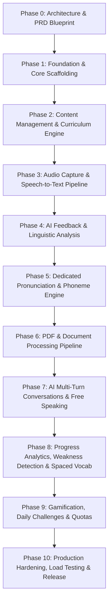

# MASTER PLAN & ARCHITECTURE ROADMAP
## English Speaking & Communication Practice Platform

---

## 1. Vision & Core Philosophy

The **English Speaking & Communication Practice Platform** is built to solve the **active output deficit** in ESL/EFL learning. Rather than passive text exercises, every feature revolves around the **deliberate speaking practice loop**:

$$\text{Learn} \longrightarrow \text{Listen} \longrightarrow \text{Speak} \longrightarrow \text{Analyze} \longrightarrow \text{Get Feedback} \longrightarrow \text{Correct} \longrightarrow \text{Repeat} \longrightarrow \text{Use in Conversation}$$

---

## 2. Multi-Client Ecosystem & Technology Stack

| Component | Technology | Primary Responsibilities |
|---|---|---|
| **Backend API** | NestJS (TypeScript, Node.js v22+) | Unified Modular Monolith, JWT Auth, RBAC, Business Logic, Database, S3 Presigned URLs, Queue Dispatch |
| **Learner Web** | Next.js 15 (App Router, React 19, TypeScript, Tailwind CSS) | Responsive desktop/tablet learning, Web Audio API 16kHz WAV recording, Audio visualizers, Practice loops |
| **Admin Web** | Next.js 15 (App Router, Tailwind CSS, TanStack Table) | Curriculum authoring (Courses, Lessons, Sentences), BullMQ queue supervision, AI cost tracking, User management |
| **Mobile App** | Flutter 3.x (Dart, Android & iOS) | Native microphone capture (`record`), gapless playback (`just_audio`), BLoC state management, offline caching |
| **Database** | PostgreSQL 16+ via Prisma ORM | Relational 3NF data store: Users, Curriculum, Practice Attempts, Transcripts, Phoneme Scores, Vocabulary |
| **Cache & Queues** | Redis 7 + BullMQ | Ephemeral token blacklist, sliding window rate limiter, async workers (STT, AI Feedback, PDF/OCR) |
| **Object Storage** | S3 / MinIO | Encrypted raw audio recordings (.wav), uploaded PDFs, curriculum reference audio |
| **Speech Engine** | Whisper API / Deepgram Nova-2 | 16kHz speech-to-text with word-level timestamps |
| **Pronunciation** | Azure Speech Assessment / Metaphone | Phoneme-level acoustic scoring (Accuracy, Fluency, Completeness, Prosody) |
| **AI Linguistic Engine** | Gemini / OpenAI (Structured Zod Output) | Contextual grammar correction, natural phrasing suggestions, conversational persona dialogue |

---

## 3. Phase-Wise Development Roadmap



### Phase 0: Product & Technical Architecture (COMPLETED)
- [x] Product Requirements Document (PRD) with CEFR levels (A1 to C1).
- [x] 4 Detailed User Personas (Global Dev, Immigrant Worker, IELTS Student, Curriculum Admin).
- [x] Full Screen Inventories for Web, Flutter, and Admin.
- [x] Normalized PostgreSQL 16 schema & Mermaid ERD.
- [x] Complete REST API contracts.
- [x] Audio storage, BullMQ queue topology, and cost control model.

### Phase 1: Foundation & Core Scaffolding (COMPLETED)
- [x] Root monorepo workspace (`package.json`, `docker-compose.yml`, `.env.example`, `.gitignore`, `README.md`).
- [x] PostgreSQL schema in `backend/prisma/schema.prisma` covering all 20+ entities.
- [x] Backend NestJS core infrastructure (`PrismaService`, `DatabaseModule`, `AllExceptionsFilter`, `TransformInterceptor`).
- [x] Security decorators and guards (`@CurrentUser`, `@Roles`, `@Public`, `JwtAuthGuard`, `RolesGuard`).
- [x] `HealthModule` with database readiness check.
- [x] `AuthModule` (Registration, Login, Token Refresh, User Profile, Argon2/Bcrypt).
- [x] `UsersModule` (Multi-step Onboarding, Profile updates, Dashboard aggregations).
- [x] Complete directory structure scaffold for all modules and frontend clients.
- [x] Web Learner base layout, Landing page, Auth screens & Onboarding (`apps/web`).
- [x] Admin Web base layout, Navigation sidebar & Operations Dashboard (`apps/admin`).
- [x] Flutter Mobile base layout, Secure storage, Router & Screens (`mobile`).

### Phase 2: Content Management & Curriculum Engine (COMPLETED)
- [x] `ContentModule` in Backend: Courses, Lessons, Sentences, Paragraphs, Stories CRUD.
- [x] Curriculum seeders: 5 starter courses, 25 lessons, 200+ practice sentences with CEFR tags (`backend/prisma/seed.ts`).
- [x] Admin Web: Curriculum data tables, sentence editor with audio URL previews (`apps/admin/app/curriculum/`).
- [x] Learner Web: Course browser, syllabus view, lesson progress cards (`apps/web/app/(learner)/courses/`).
- [x] Flutter Mobile: Practice category hub, course syllabus view with lock/unlock states (`mobile/lib/features/practice/`).

### Phase 3: Audio Capture & Speech-to-Text Pipeline (COMPLETED)
- [x] Backend `StorageModule`: S3/MinIO pre-signed URL generator with magic-byte validation (`backend/src/storage/`).
- [x] Backend `SpeechModule`: STT provider abstraction (`WhisperSpeechProvider`, `MockSpeechProvider`, `SpeechService`).
- [x] BullMQ `audio-transcription-queue` and worker processor.
- [x] Word-level Token Diff Engine with Levenshtein alignment (`backend/src/modules/practice/diff.service.ts`).
- [x] Web Audio 16kHz WAV recorder (`useAudioRecorder.ts` with Web Audio API).
- [x] Flutter Native Audio recorder service (`mobile/lib/core/audio/audio_recorder_service.dart`).
- [x] Sentence Practice UI across Web & Mobile: Listen $\rightarrow$ Record $\rightarrow$ Diff visualization $\rightarrow$ Retry.

### Phase 4: AI Feedback Engine & Detailed Scoring (COMPLETED)
- [x] Backend `AiFeedbackModule`: Structured Zod schema output parser (`ai-feedback.schema.ts`).
- [x] System prompts for grammar correction, tense critique, and fluency scoring (`ai-feedback.service.ts`).
- [x] Resilient deterministic linguistic fallback analyzer for offline/zero-API-key setups.
- [x] Persistence of `AiFeedbackRecord` linked to `PracticeAttempt`.
- [x] Score Card, Grammar Error Highlighting, and Suggestions UI components on Web and Mobile.

### Phase 5: Dedicated Pronunciation & Phoneme Engine (COMPLETED)
- [x] Backend `PronunciationModule`: Acoustic phoneme alignment provider (`AzureSpeechProvider`, `MockPronunciationProvider`).
- [x] Phoneme comparison against ground truth IPA symbols (`pronunciation.interface.ts`).
- [x] Syllable stress and pitch intonation evaluation.
- [x] Interactive IPA Phoneme Visualizer widget on Web Learner (`PhonemeVisualizer.tsx`).
- [x] Persistence of `phoneme_evaluations` records in database.

### Phase 6: PDF / Document Learning Pipeline (COMPLETED)
- [x] Backend `DocumentsModule`: Upload handler, metadata tracking, and S3 storage (`backend/src/modules/documents/`).
- [x] Structural parsing and sentence boundary tokenizer (`pdf-parser.service.ts`).
- [x] Automated CEFR readability index classification on extracted sentences.
- [x] Learner Web: Drag-and-drop PDF uploader and custom speaking drill generator (`apps/web/app/(learner)/documents/page.tsx`).
- [x] Persistence of `documents` and `document_chunks` records in database.

### Phase 7: AI Multi-Turn Conversations & Free Speaking (COMPLETED)
- [x] Backend `ConversationsModule`: Scenario state machine with roleplay personas (`ConversationsService`).
- [x] Contextual turn-by-turn processing with LLM context and grammar critique (`POST /conversations/sessions/:id/turn`).
- [x] Session lifecycle management and diagnostics (`conversations.controller.ts`).
- [x] Web Interactive Voice Conversation interface (`apps/web/app/(learner)/conversations/page.tsx`) with browser speech synthesis and push-to-talk.
- [x] Persistence of `conversation_scenarios`, `conversation_sessions`, and `conversation_messages`.

### Phase 8: Progress Analytics, Weakness Detection & Spaced Vocabulary (COMPLETED)
- [x] Backend `VocabularyModule`: Dictionary storage, master words, and SuperMemo SM-2 algorithm scheduler (`vocabulary.service.ts`).
- [x] Backend `ProgressModule`: Daily streak tracking, practice minutes and words spoken rollups, skill radar, and weakness detection (`progress.service.ts`).
- [x] Learner Web Vocabulary Deck (`apps/web/app/(learner)/vocabulary/page.tsx`) with interactive flashcards and 4-tier SM-2 recall rating buttons.
- [x] Learner Web Progress Dashboard (`apps/web/app/(learner)/progress/page.tsx`) with skill radar and weakness remedial drill links.

### Phase 9: Gamification, Daily Challenges & Quotas (COMPLETED)
- [x] Daily Speaking Challenge generator and community leaderboard (`backend/src/modules/challenges/`, `apps/web/app/(learner)/challenges/today/page.tsx`, `mobile/lib/features/challenges/daily_challenge_screen.dart`).
- [x] Redis-backed daily usage quota enforcer (Free: 20 sentences/day; Premium: Unlimited) (`backend/src/modules/subscriptions/`).
- [x] Stripe customer portal and webhook listener for Subscription lifecycle (`apps/web/app/(learner)/subscription/page.tsx`, `mobile/lib/features/subscription/subscription_screen.dart`).
- [x] Admin Web: Daily challenge scheduler and active user spend analytics (`apps/admin/app/challenges/page.tsx`, `apps/admin/app/dashboard/page.tsx`).

### Phase 10: Production Hardening, Load Testing & Launch (COMPLETED)
- [x] Automated Unit & Integration Tests: DP Levenshtein Diff (`diff.service.spec.ts`), SuperMemo SM-2 Spaced Repetition (`vocabulary.service.spec.ts`), AuthService JWT flows (`auth.service.spec.ts`).
- [x] Standalone verification runner executing and passing 12/12 algorithmic tests (`backend/test-algorithms.js`).
- [x] E2E testing: Playwright test suite covering complete learner deliberate practice journey (`apps/web/e2e/learner-flow.spec.ts`).
- [x] Load testing: k6 stress test simulating 1,000 concurrent speaking attempts & pre-signed audio uploads (`load-tests/audio-upload-stress.js`).
- [x] Security audit: OWASP Top 10 checklist, pre-signed upload TTL constraints, and Zod output sanitization (`docs/security_hardening.md`).
- [x] CI/CD deployment pipeline: GitHub Actions workflow building and testing Backend, Web, Admin, and Flutter (`.github/workflows/ci.yml`).
- [x] Multi-stage production containerization: Dockerfiles for Backend, Learner Web, and Admin Web (`backend/Dockerfile`, `apps/web/Dockerfile`, `apps/admin/Dockerfile`).

---

## 4. Module-Wise Architecture & Directory Structure

```text
/home/aavatto/English/
│
├── PLAN.md                               # Master Technical & Phased Plan (This File)
├── README.md                             # Repository Overview & Quick Start Guide
├── docker-compose.yml                    # Local Services (Postgres 16, Redis 7, MinIO, Backend, Web)
├── .env.example                          # Canonical Environment Variable Template
├── .gitignore                            # Unified Ignore Rules (Node, Next, Flutter, Storage)
├── package.json                          # Monorepo Workspace Configuration
│
├── backend/                              # Modular Monolith Backend API (NestJS)
│   ├── Dockerfile                        # Multi-stage production container build
│   ├── package.json                      # Backend dependencies & scripts
│   ├── tsconfig.json                     # Strict TypeScript configuration
│   ├── prisma/
│   │   ├── schema.prisma                 # 20+ Normalized PostgreSQL entities
│   │   └── seed.ts                       # Starter curriculum and CEFR seed data
│   │
│   └── src/
│       ├── main.ts                       # App Bootstrap, Helmet, CORS, Swagger, Validation
│       ├── app.module.ts                 # Root AppModule importing all domain modules
│       │
│       ├── database/                     # Database Persistence Layer
│       │   ├── prisma.service.ts         # PrismaClient singleton
│       │   └── database.module.ts        # Global DatabaseModule
│       │
│       ├── common/                       # Cross-Cutting Core Infrastructure
│       │   ├── decorators/               # @CurrentUser, @Roles, @Public
│       │   ├── filters/                  # AllExceptionsFilter (Uniform error envelope)
│       │   ├── guards/                   # JwtAuthGuard, RolesGuard, QuotaGuard
│       │   ├── interceptors/             # TransformInterceptor (Uniform success envelope)
│       │   └── pipes/                    # Validation and UUID pipes
│       │
│       ├── queue/                        # BullMQ Distributed Queue Fleet
│       │   ├── queue.constants.ts        # Queue names (audio, ai, pdf, notification)
│       │   ├── queue.module.ts           # BullMQ connection and module setup
│       │   └── processors/               # Dedicated worker processors
│       │
│       ├── storage/                      # Object Storage Service (S3 / MinIO)
│       │   ├── storage.service.ts        # Pre-signed upload & download URL generator
│       │   └── storage.module.ts         # Storage module export
│       │
│       └── modules/                      # Domain Feature Modules
│           ├── health/                   # Service liveness & database readiness
│           ├── auth/                     # JWT auth, register, login, refresh, password reset
│           ├── users/                    # Onboarding, user profiles, dashboard metrics
│           ├── content/                  # Courses, lessons, sentences, paragraphs, stories
│           ├── practice/                 # Practice sessions, attempt lifecycle, scoring
│           ├── speech/                   # STT provider abstraction (Whisper, Deepgram)
│           ├── ai-feedback/              # LLM grammar, fluency, and correction prompts
│           ├── pronunciation/            # Acoustic phoneme alignment & scoring
│           ├── documents/                # PDF upload, text extraction, OCR, sentence parsing
│           ├── conversations/            # Multi-turn voice dialogue scenarios & personas
│           ├── vocabulary/               # Dictionary, word definitions, SuperMemo SM-2 deck
│           ├── progress/                 # Streaks, daily progress rollups, radar metrics
│           ├── challenges/               # Daily speaking challenges & leaderboards
│           ├── subscriptions/            # Quota tracking, tier checks, Stripe webhooks
│           └── admin/                    # Curriculum curation APIs & platform telemetry
│
├── apps/
│   ├── web/                              # Learner Web Application (Next.js 15)
│   │   ├── Dockerfile                    # Web production container build
│   │   ├── package.json                  # Next.js, React 19, Tailwind, Radix UI
│   │   ├── tsconfig.json                 # Web TypeScript configuration
│   │   ├── tailwind.config.ts            # Design tokens, color palette, typography
│   │   │
│   │   ├── app/                          # Next.js 15 App Router
│   │   │   ├── layout.tsx                # Root layout with QueryClient & Theme Provider
│   │   │   ├── page.tsx                  # Public Landing Page with audio demos
│   │   │   ├── (auth)/                   # Unauthenticated route group
│   │   │   │   ├── login/page.tsx
│   │   │   │   ├── register/page.tsx
│   │   │   │   └── forgot-password/page.tsx
│   │   │   ├── onboarding/page.tsx       # Multi-step onboarding questionnaire
│   │   │   │
│   │   │   └── (learner)/                # Authenticated learner portal layout
│   │   │       ├── dashboard/page.tsx    # Daily goal progress, streaks, recommendations
│   │   │       ├── courses/              # Course browser and syllabus
│   │   │       ├── practice/             # Sentence, Paragraph, Story practice modes
│   │   │       │   ├── sentence/[id]/    # Core listen-record-diff-retry interface
│   │   │       │   ├── paragraph/[id]/   # Paragraph reading interface
│   │   │       │   ├── story/[id]/       # Narrative story reader
│   │   │       │   ├── listen-repeat/    # Dedicated shadowing interface
│   │   │       │   └── free-speaking/    # 60-second monologue recorder
│   │   │       ├── conversations/        # Scenario voice chat
│   │   │       ├── vocabulary/           # Personal dictionary & SM-2 review deck
│   │   │       ├── documents/            # PDF upload & practice chunk generator
│   │   │       ├── challenges/           # Daily challenge recorder & leaderboard
│   │   │       ├── progress/             # CEFR radar, WPM charts, weakness breakdown
│   │   │       ├── profile/              # Account settings & audio input configuration
│   │   │       └── subscription/         # Plan details, usage meters, upgrade modal
│   │   │
│   │   ├── components/                   # Reusable UI Primitives & Widgets
│   │   │   ├── ui/                       # Buttons, Dialogs, Sliders, Dropdowns
│   │   │   ├── audio/                    # Waveform visualizer, AudioPlayer, MicButton
│   │   │   └── feedback/                 # ScoreCircle, PhonemeBadge, GrammarDiffViewer
│   │   │
│   │   ├── hooks/                        # Custom React Audio & API Hooks
│   │   │   ├── useAudioRecorder.ts       # 16kHz WAV capture via Web Audio API
│   │   │   ├── useAudioPlayer.ts         # Audio playback controller with time sync
│   │   │   └── useSpeechRecognition.ts   # Audio upload & evaluation trigger hook
│   │   │
│   │   ├── lib/                          # API client with JWT interceptor, utilities
│   │   └── stores/                       # Zustand stores for active practice state
│   │
│   └── admin/                            # Admin Web Application (Next.js 15)
│       ├── Dockerfile
│       ├── package.json
│       ├── tsconfig.json
│       ├── app/
│       │   ├── layout.tsx                # Admin portal layout with navigation sidebar
│       │   ├── dashboard/page.tsx        # Platform telemetry, active learners, spend
│       │   ├── curriculum/               # Courses, Lessons, Sentences management
│       │   ├── documents/                # Ingested PDFs & OCR re-processing
│       │   ├── ai-jobs/                  # BullMQ queue monitor and DLQ retries
│       │   ├── users/                    # User search, quota overrides, role management
│       │   ├── challenges/               # Daily challenge scheduler
│       │   └── settings/                 # API provider keys, tier quota thresholds
│       └── components/                   # Admin data tables, metrics cards, form builders
│
├── mobile/                               # Mobile Application (Flutter 3.x for Android & iOS)
│   ├── pubspec.yaml                      # Dependencies: flutter_bloc, record, just_audio, dio
│   ├── analysis_options.yaml             # Strict Dart lint rules
│   │
│   ├── lib/
│   │   ├── main.dart                     # App bootstrap, BlocObserver, service locator setup
│   │   │
│   │   ├── core/                         # Cross-Cutting Infrastructure
│   │   │   ├── audio/                    # AudioRecorderService & AudioPlayerService
│   │   │   ├── network/                  # Dio API client, interceptors, endpoints
│   │   │   ├── storage/                  # flutter_secure_storage for JWTs, local cache
│   │   │   ├── permissions/              # Mic permission helper with education modals
│   │   │   ├── routing/                  # GoRouter shell hierarchy & route guards
│   │   │   ├── theme/                    # App colors, dark mode, typography
│   │   │   └── errors/                   # Failure classes & exception handlers
│   │   │
│   │   └── features/                     # Feature-First Architecture
│   │       ├── auth/                     # LoginScreen, RegisterScreen, AuthBloc
│   │       ├── onboarding/               # OnboardingScreen (Level, Goals, Target)
│   │       ├── home/                     # HomeScreen, StreakWidget, DailyGoalCard
│   │       ├── practice/                 # PracticeHub, SentencePracticeScreen, DiffSpan
│   │       ├── conversation/             # ConversationChatScreen, VoiceBubbleStream
│   │       ├── vocabulary/               # VocabularyListScreen, FlashcardSwipeView
│   │       ├── documents/                # DocumentListScreen, PdfPickerModal
│   │       ├── progress/                 # ProgressDashboardScreen, CefrRadarView
│   │       ├── challenges/               # DailyChallengeScreen, AudioRecordModal
│   │       ├── profile/                  # ProfileSettingsScreen, MicSensitivity
│   │       └── subscription/             # PaywallScreen, QuotaProgressBar
│   │
│   ├── android/                          # Native Android runner & permissions manifest
│   └── ios/                              # Native iOS runner & Info.plist microphone usage
│
└── docs/                                 # Architectural & Operational Documentation
    ├── architecture.md                   # Detailed system & network topology
    ├── api_specification.md              # Complete REST endpoint contracts
    ├── database_schema.md                # PostgreSQL schema & indexing rules
    └── deployment_guide.md               # Docker, Kubernetes & App Store runbooks
```

---

## 5. Next Immediate Execution Steps (Continuing Phase 1)

1. **Scaffold the complete directory tree** for `backend/src/modules/`, `apps/web/`, `apps/admin/`, and `mobile/` with standard module declarations and `.gitkeep` markers.
2. **Build the Web Learner Application Base (`apps/web`)**:
   - Next.js 15 configuration (`package.json`, `tsconfig.json`, `tailwind.config.ts`).
   - Base UI components (Button, Input, Card, Badge, Header, Footer).
   - Auth screens (`login/page.tsx`, `register/page.tsx`).
   - Multi-step Onboarding screen (`onboarding/page.tsx`).
   - Web API Client (`lib/api-client.ts`).
3. **Build the Flutter Application Base (`mobile`)**:
   - `pubspec.yaml` with all dependencies (`flutter_bloc`, `record`, `just_audio`, `dio`, `go_router`, `flutter_secure_storage`).
   - Core audio, network, and storage services.
   - Auth screens and navigation router.
4. **Build the Admin Console Base (`apps/admin`)**:
   - Next.js admin configuration and dashboard shell.
5. **Verify Phase 1 Foundation**:
   - Run type checks, build tests, and backend endpoint verification.

