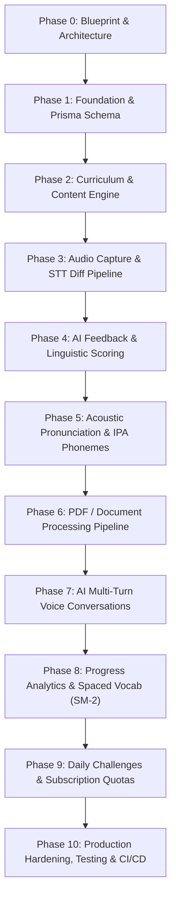

# Phase-by-Phase Implementation Directory

This directory contains the detailed documentation for each phase of the **English Speaking & Communication Practice Platform**. Every phase document specifies:
- **Phase Objective & Mission**
- **Features Implemented**
- **File Structure & Exact Files Created/Modified** (with clickable links)
- **Database Schema Models & Enums**
- **API Endpoints & Contracts**
- **Frontend Clients Built (Learner Web, Admin Web, Flutter Mobile)**
- **Verification & Testing Instructions**

---

## Phases Navigation

| Phase | Title | Focus Area | Status | Document Link |
|---|---|---|---|---|
| **Phase 0** | **Product & Architecture Blueprint** | PRD, CEFR bands (A1–C1), Personas, Schema Blueprint | `COMPLETED` | [Phase 0 Guide](file:///home/aavatto/English/phases/phase-00-product-and-architecture.md) |
| **Phase 1** | **Foundation & Scaffolding** | Monorepo, Docker, 26 Prisma Models, JWT Auth, Users, Guards | `COMPLETED` | [Phase 1 Guide](file:///home/aavatto/English/phases/phase-01-foundation-and-scaffolding.md) |
| **Phase 2** | **Curriculum & Content Engine** | Courses, Lessons, Sentences CRUD, Database Seeder, Syllabus UI | `COMPLETED` | [Phase 2 Guide](file:///home/aavatto/English/phases/phase-02-curriculum-and-content.md) |
| **Phase 3** | **Audio Capture & STT Pipeline** | Pre-signed S3, Whisper STT, DP Levenshtein Word Diff, Web Audio WAV | `COMPLETED` | [Phase 3 Guide](file:///home/aavatto/English/phases/phase-03-audio-capture-and-speech-to-text.md) |
| **Phase 4** | **AI Feedback & Scoring Engine** | Zod Schema Validation, LLM Linguistic Feedback, Weighted Scoring | `COMPLETED` | [Phase 4 Guide](file:///home/aavatto/English/phases/phase-04-ai-feedback-and-scoring.md) |
| **Phase 5** | **Pronunciation & Phoneme Engine** | Azure Acoustic Phonemes, IPA Inspection, Visual Phoneme Component | `COMPLETED` | [Phase 5 Guide](file:///home/aavatto/English/phases/phase-05-pronunciation-and-phonemes.md) |
| **Phase 6** | **PDF & Document Learning Pipeline** | Chapter Chunker, CEFR Estimator, Personalized Practice Drills | `COMPLETED` | [Phase 6 Guide](file:///home/aavatto/English/phases/phase-06-document-and-pdf-learning.md) |
| **Phase 7** | **AI Voice Conversations & Roleplay** | Multi-Turn Personas (Standup, Interview, Hotel), Speech Bubbles | `COMPLETED` | [Phase 7 Guide](file:///home/aavatto/English/phases/phase-07-ai-voice-conversations.md) |
| **Phase 8** | **Progress Analytics & Spaced Vocab** | SuperMemo SM-2 SRS Deck, Skill Radar Chart, Weakness Drill Links | `COMPLETED` | [Phase 8 Guide](file:///home/aavatto/English/phases/phase-08-progress-analytics-and-spaced-vocab.md) |
| **Phase 9** | **Gamification, Challenges & Quotas** | Daily Speaking Quest, Community Leaderboard, Stripe Quotas | `COMPLETED` | [Phase 9 Guide](file:///home/aavatto/English/phases/phase-09-gamification-challenges-and-quotas.md) |
| **Phase 10**| **Production Hardening & Testing** | 12/12 Algorithmic Tests, Unit Tests, Playwright E2E, Docker, CI/CD | `COMPLETED` | [Phase 10 Guide](file:///home/aavatto/English/phases/phase-10-production-hardening-and-testing.md) |

---

## Architectural Dependency Flow

